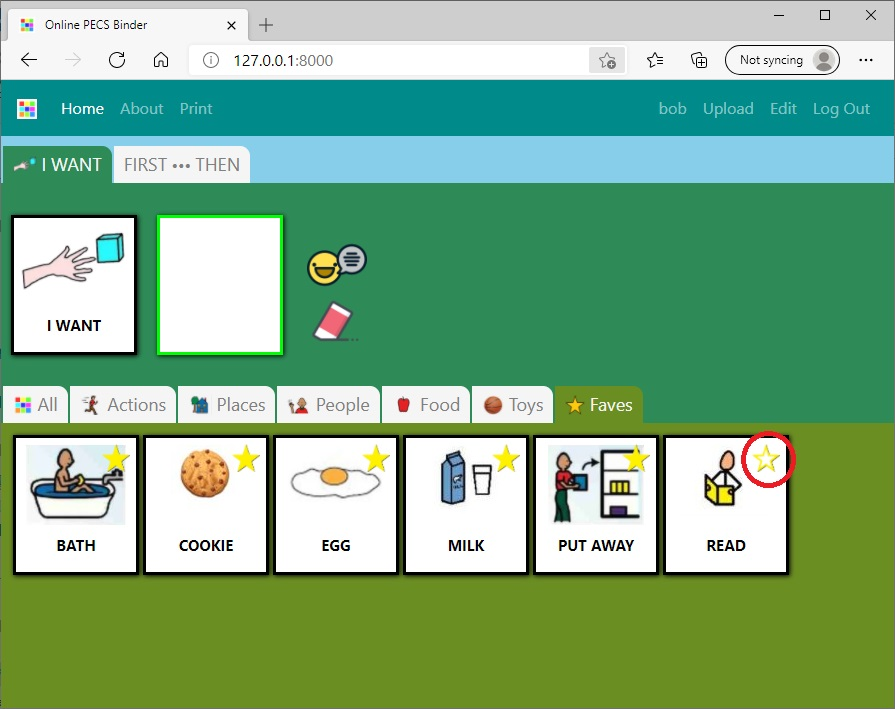

CS50W 2020 CAPSTONE - [Online PECS binder](https://binder2.herokuapp.com/)
 
# Introduction
 

 

PECS stands for Picture Exchange Communication System.
 
PECS is a communication system designed for individuals with communication challenges such as individuals that are non-verbal.
 
PECS have different phases and The Online PECS Binder is designed for use in the 4th Phase where individuals use an “I Want” picture followed by a picture of the item being requested.
 
This application aims to provide an online digital tool to facilitate the exchange part in the PECS process, specifically, providing digitally uploaded PECS images, arranged and sorted through tabs and categories, and, play an audio feedback equivalent of the images. 

 
More about PECS communication process from Pyramid Educational Consultants who developed the PECS - 
[https://pecs.com/picture-exchange-communication-system-pecs/](https://pecs.com/picture-exchange-communication-system-pecs/) 
 
 
# Project Requirements
 
## CS50W Project Requirements
 
### Distinctiveness
 

In the 4th phase of the PECS process, individuals choose PECS or images to complete the "I Want" sentence structure and Audio feedback is inherently part of the communication process.
 
The Online PECS Binder aims to provide a digital counterpart of a physical binder by accepting uploaded images, to be used as PECS, then utilizes the gTTs text-to-speech library to convert to the images' audio equivalent. 
 
Django, CSS, and JS are utilized to prepare and deliver this data and information to the website that closely mimic the look and feel of a Physical Binder. More information on the design considerations can be found in the succeeding section.

 
### Complexity
The complexity of the project is with the implementation of the tool to provide a similar experience with a physical binder, specifically: 
- Allow a user to add more images to Online Binder and an equivalent audio file for the uploaded image must be generated.
- Present the user with Category Tabs and allow the user to select tabs and be presented with the images that are tagged with the category, these should be done without reloading the whole page.
- Allow a user to tag an image as a favorite.
- Provide an audio feedback of the image's audio equivalent when an image is clicked or chosen.
- Allow a user to complete a Sentence Structure strip and provide an audio feedback.
 
### Project Implementation using Django with JS
 

The application utilizes Django in the backend using models to manage Registered users, Images, Tags and Favorites.  
 
The Django project name is binder and has a single app pecs.
- #### Project name: binder
- #### App name: pecs
 
The Models used are described in more detail in the succeeding section.
 
JS with a combination of the jQuery Library is utilized in the frontend, specifically the use of APIs, so information is delivered without the need to reload the page every time an individual provides input to the application. Further details on how this was accomplished is found in succeeding sections.

 
### Responsiveness
 
The application utilizes CSS and the BootStrap Library to provide a responsive design. The layout adapts to the screen size when the browser window is minimized or viewed on a mobile device.
 
# Features and Design Considerations
 
## Multi-page application
The application is a multi-page application, since the main feature is in the index page, it has been designed to separate the rest of the applications's other functions (i.e. upload, edit, and print) on separate pages instead.
 
## Look and Feel
 

&nbsp;

 

The layout is designed to mimic the look and feel of a physical binder as such, the layout design is minimalistic with pastel colors to give more attention and focus on the PECS or images themselves.

 
## Print

 
Although the Online PECS Binder aims to provide a similar tool to that of a physical binder, the Online PECS Binder should not be considered as a full replacement. A physical binder is still recommended especially for individuals in the first phases. 
 
The Online PECS Binder recognizes the difficulty of having to use a document processing application to format and prepare an image for printing. As such, the Online PECS Binder features a Print function where individuals can select multiple PECS and the application will prepare and format it for printing.  

 
## User Registration
 
Although the application is designed to allow for use without logging-on or registering, features such as upload, edit and tag favorites are available to registered and logged on users only.  
 
### Upload
 
Registered Logged-on user can upload images that will be can be made available in the Online PECS Binder. Apart from the images availabel to all users, the logged-on user will also see the PECS that they themselves uploaded.
 
The Special User PUBLIC is a special user that uploaded the stanadard PECS available to all users. This special user is used to manage these PECS in-app.
 
### Edit Function
 

 

 
The Application provides an Edit page to modify or delete an image. The Edit Page is provided on an entirely different page and is done so by design to make sure that the individual using the application do not accidentally edit or delete the image during normal use. 
 
note: A user can only edit the pecs they uploaded. 
 
The special user PUBLIC uses this same application function to edit the standard PECS. 

 
### Favorites

 

 
Individuals can toggle a PECS as a favorite through a star button. All the PECS tagged as favorites should appear in the Favos tab.
 
In the favorite tab, the individual can choose to un-tag the PECS as favorite but the PECS itself will remain in the section until reloaded. This is done by design as consideration on instances where the favorite button was toggled by mistake thus giving the individual a chance to toggle the button again.
 
Any changes to the tags in the favorite section will reflect once the tab is reloaded.
 

 
# Installation
 
## requirements.txt
Install all dependent packages in requirements.txt including djanhp, gTTs and Pillow
 
    $ pip install -r requirements.txt
 
## Primary Packages used
 
### gTTs (Google Text-to-Speach)
 
 [gTTS](https://gtts.readthedocs.io/en/latest/) is used to convert text into speech and is a requirement to convert the Image description into audio upon upload.
 
### Pillow
 
[Pillow](https://pypi.org/project/Pillow/) Python Imaging Library is used for the model ImageField to upload images.
 
## Initialize Database
Database uses sqlite3. Apply migrations when deploying the application.
 
    $ python manage.py makemigrations
    $ python manage.py migrate
 
Create the superuser
 
    $ python manage.py createsuperuser
 
## Admin Interface
### PUBLIC user
Using the admin interface, create the second user to be used to upload the standard pecs to the database.
 
Important! The PECS images displayed to all users including non-registered are uploaded in-app by this special user.
 
### Tag categories
Using the admin interface, create the tags in the order below:
 - All
 - Actions
 - Places
 - People
 - Food
 - Toys
 
### Upload standard PECS
The Standard PECS that are made available to all users are done in-app using the PUBLIC account. The application queries all images uploaded by PUBLIC to show all users.
 
# Models
 
## User
Standard Django User model and no extensions added.
 
## Image
Model to store information on uploaded images:
- Name - Filename of the uploaded image stored in the media folder.
- Description - Text description of the Image that will be converted into Audio.
- Tag - Category Tag of the image which is a Foreign key to Tag Model. 
 
## Tag
Tag Model stores the categories to be used by the application and is referenced by the Image mode. The tag values are added in the admin interface using the superuser account.
 
## Favorite
Model to store the tagged favorite of a registered user.
 
# Folder and Files
 
## Folder Structure
 
    ├───binder                  Project Folder
    ├───pecs                    Application Folder
    │   ├───static              Static Folder
    │   │   ├───pecs
    │   │   │   ├───audio       
    │   │   │   ├───images
    │   │   │   └───scripts
    │   ├───templates           Template Folder
    │   │   └───pecs            
    └───upload                  Media Folder
        ├───audio               converted audio files in mp3
        └───uploads             uploaded images
 
 
# Project Files
 
## project settings.py
Add the following lines at the bottom of the project settings.py
 
    LOGIN_URL = '/login'
    STATIC_URL = '/static/'
    MEDIA_URL = '/upload/'
 
# Application Files
 
## models.py
contains the Models used by the project. More description information has been provided on a preceding section.
 
## admin.py
Registered the models that are available to be managed form the admin interface. 
 
## urls.py
Contains the URL Patterns used by the application.
 
    urlpatterns = [
        ...
    ]
 
## forms.py
defines a form for the Image model which is used by upload.html
 
    class ImageForm(forms.ModelForm):
        class Meta:
            model = Image
            fields = ('name', 'description', 'tag', )
 
## views.py
### Imported Packages
 
    import os
    import json
    ...
    from gtts import gTTS
 
### @login_required decorator
Paths that require that the user is authenticated will have the login_required decorator. 
LOGIN_URL must be deifned in settings.py so that the application can redirect to the login page.
 
    @login_required
 
### convert_speech function
Function using gTTs to convert text to audio.
 
    def convert_speech(text, file_name):
        convert = gTTS(text=text, lang='en')
        convert.save(f"upload/audio/{file_name}.mp3")
 
# html templates
 
## register.html
html template to register for log-in account.
 
## login.html
html template used by a user to log-in to the application.
 
## layout.html
html template that contains the navigator bar that appears on all pages.  
All html pages will include this line on the top.
    
    
 
Uses the [django messages framework](https://docs.djangoproject.com/en/3.1/ref/contrib/messages/) to display html alert messages
 
    
    <ul class="messages">
        
        <li class="{{ message.tags }}">
            Important: 
            {{ message }}
        </li>
        
    </ul>
    
 
## index.html
index page is the default path of the application and can also be reached through the home link in the nav bar.  
The index is the primary feature of the application and renders the strip sentence structure and category tabs which defaults to All. The index also has a div element placeholder where a javascript function loads pecs.html using the jQuery AJAX .load() method.
## pecs.html
An html template used to display the PECS images. Once a Tag or Category is chosen by the user from the index page, a get request is sent to the server via the jQuery AJAX .load(). The response is the pecs html with the filtered objects for the corresponding category.
## about.html
Contains introductory information on the application.
## upload.html
An html page used by a registered logged-on user to upload images to the application. The page renders a django form defined in forms.py and upon successful submission, the information is recorded in the database and a function in views called convert_speech is called to create an audio version of the description in mp3 format.
## edit.html
An html page used to render the PECS uploaded by the logged on user. The user can delete the PECS image or change the tag and description. If the description is changed, the function calls convert_speech again to recreate the audio file with the new image description.
## print.htnl
A separate page to display PECS with checkboxes which allows the user to check and include the PECS to the printed page, or unchecked to remove them from the print. The page accomplishes this through JS and adds or removes the BootStrap d-print-none class where the element is excluded from print display.
 
    class="d-print-none" 
 
 
# Scripts
## <page_name>.js
This line of code is used to add or remove the Navigator BootStrap active class.   
This will be found in: about.js, edit.js, index.js, layout.js and index.js files. 
 
    $('.nav-item').removeClass('nav-item active').addClass('nav-item')
    $('#active_page_id').parent().removeClass('nav-item').addClass('nav-item active')
- where the *active_page_id* is the id of the navigator link that is active.
 
## layout.js
The layout.js acquires the csrf token as defined in the django document [csrf protection](https://docs.djangoproject.com/en/3.1/ref/csrf/)
 
    function getCookie(name) {
        let cookieValue = null;
        if (document.cookie && document.cookie !== '') {
            const cookies = document.cookie.split(';');
            for (let i = 0; i < cookies.length; i++) {
                const cookie = cookies[i].trim();
                // Does this cookie string begin with the name we want?
                if (cookie.substring(0, name.length + 1) === (name + '=')) {
                    cookieValue = decodeURIComponent(cookie.substring(name.length + 1));
                    break;
                }
            }
        }
        return cookieValue;
    }
    const csrftoken = getCookie('csrftoken');   
 
## index.js
Includes a listener to detect a click on a favorite button and call a fetch API to update the Favorite model for the user. 
 
Includes the JS code to render the PECS images using the jQuery AJAX load method. 
The script also contains listeners to detect a click on a different Category Tab and calls the AJAX load to request for filtered PECS images.
 
    $('#placeholder_id').load('/pecs?cat=' + category)
 
- where *placeholder_id* is the id of the element container that will show the loaded contents.
- category is the tab clicked.
 
## edit.js
Includes listeners and a JS fetch API to update, or delete the edited PECS without reloading the page.
 
## print.js
Includes a click listener and uses the jQuery addClass and removeClass to add or remove the BootStrap class d-print-none. 
An element with the d-print-none class is not included in the print page.
 
    $('input').click(function(evt) {
    if (evt.target.checked) {
        $('#p_pecs_'+evt.target.value).removeClass('d-print-none')
    } else {
        $('#p_pecs_'+evt.target.value).addClass('d-print-none')
    }
 
- where input is the html tag that corresponds to the checkboxes.
- p_pecs_ is the element container of the PECS.
  
# stylesheets
 
## BootStrap
BootStrap added through a CDN linked in the layout template.
 
        
        <link href="https://cdn.jsdelivr.net/npm/bootstrap@5.0.0-beta2/dist/css/bootstrap.min.css" rel="stylesheet" .. >
        <link rel="stylesheet" href="https://cdn.jsdelivr.net/npm/bootstrap@4.5.3/dist/css/bootstrap.min.css" ..>            
        
 
## pecs.css
Uses Media Screen to detect width and height and change css styles to adapt.
 
    @media only screen {
        ...
    }
 
Media Print to define print paper size.
 
    @media print {
        ...
    }
 

